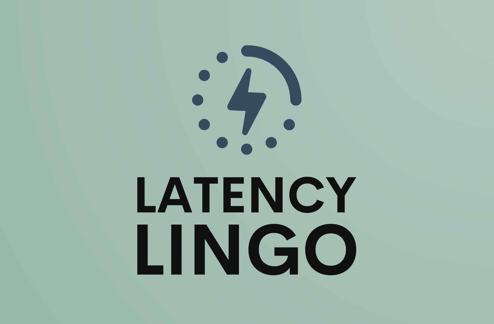

# Latency Lingo CLI

[Latency Lingo](https://latencylingo.com) is helps software team analyze and collaborate on performance test result data.



This CLI is the main method to publish test metrics from your load test runner to Latency Lingo APIs. JMeter and Gatling are currently supported with Locust and k6 formats planned.

## Usage

Please see the [documentation site](https://docs.latencylingo.com/docs/getting-started) for installation and usage.

## Examples

```sh
latency-lingo-cli publish \
  --file ./test_results_jmeter.jtl \
  --label "checkout flow"
  --api-key 05b6c656-006b-4107-991d-96a5a2a3227c
```

```sh
latency-lingo-cli publish \
  --file ./test_results_gatling.log \
  --label "checkout flow - gatling test"
  --api-key 05b6c656-006b-4107-991d-96a5a2a3227c
  --format gatling
```
